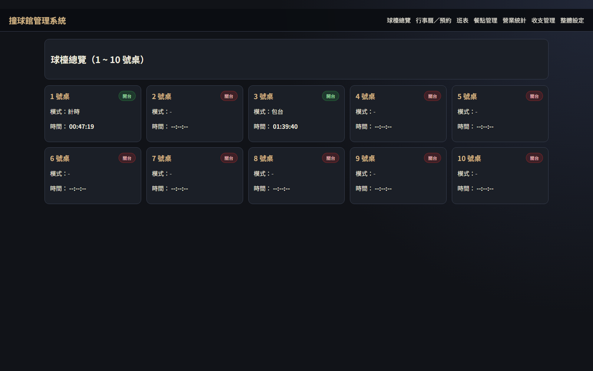
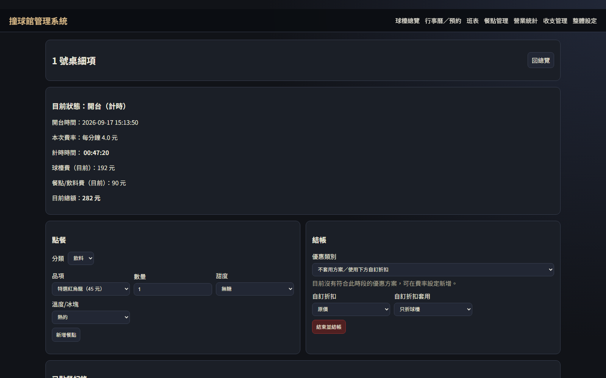
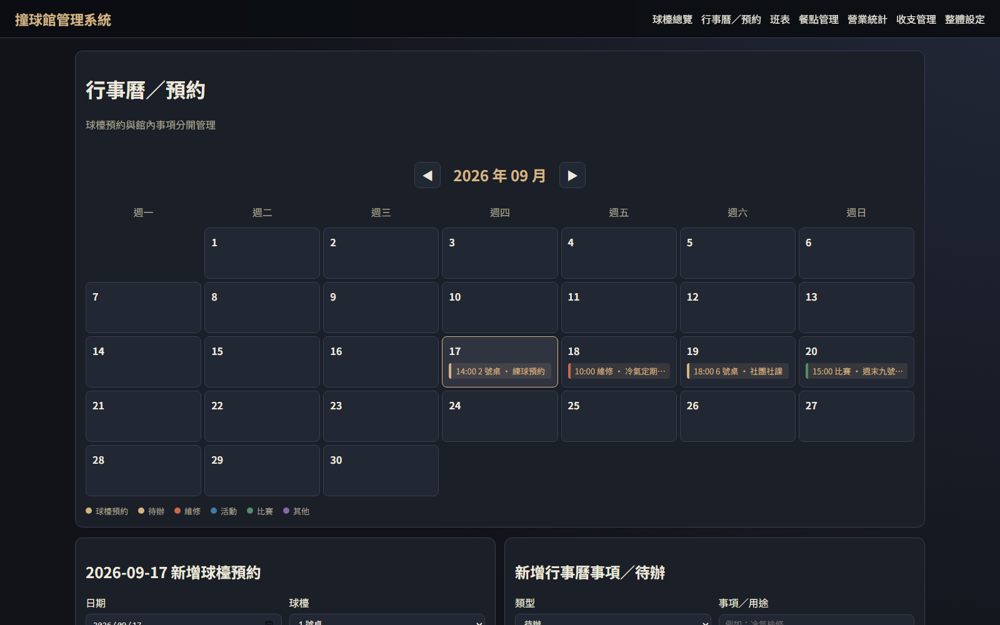
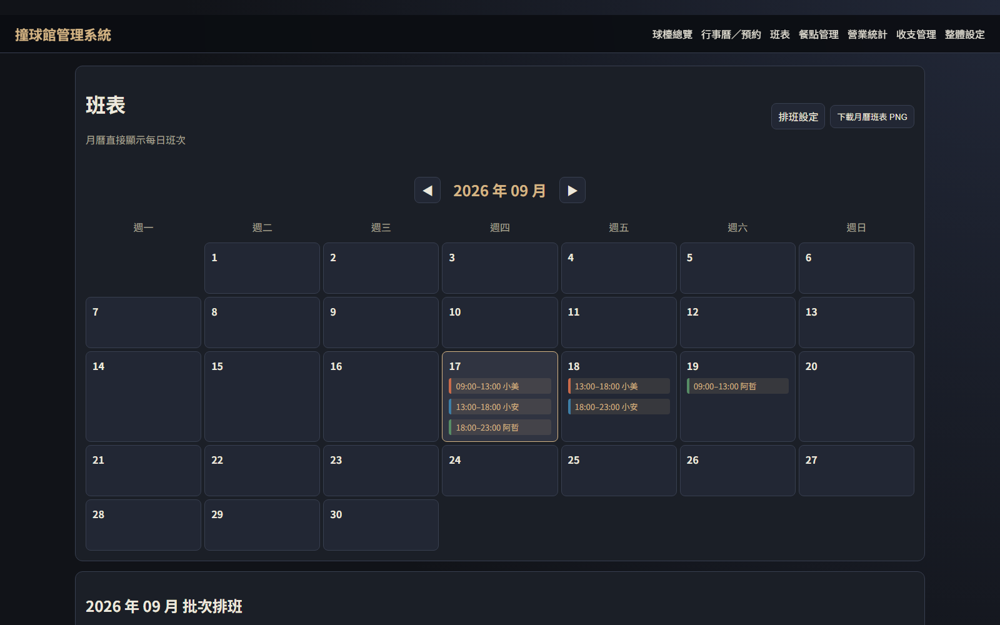
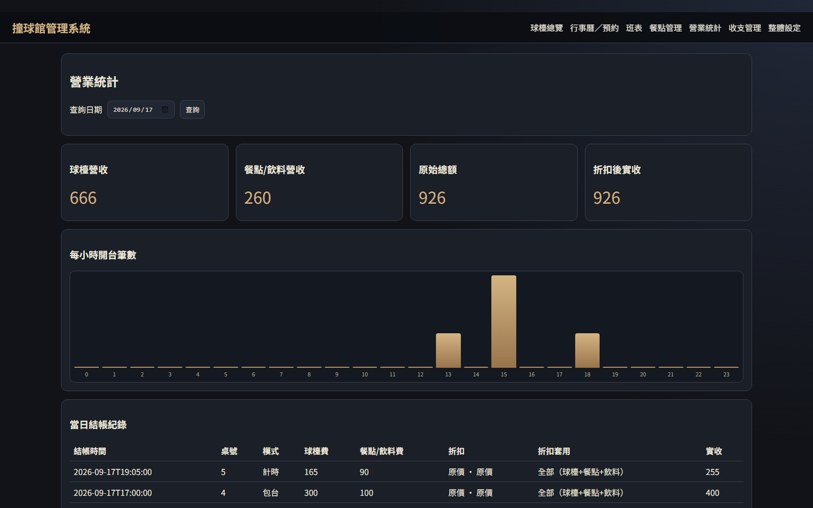
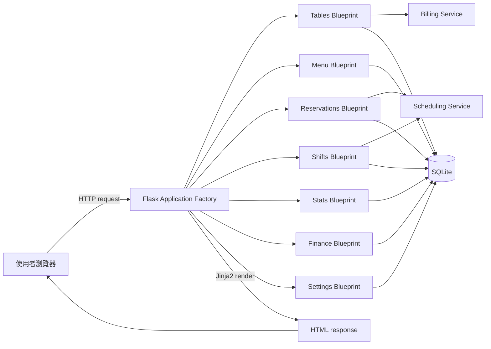
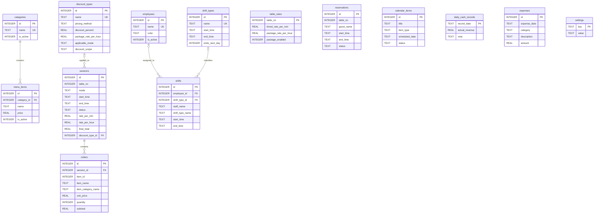
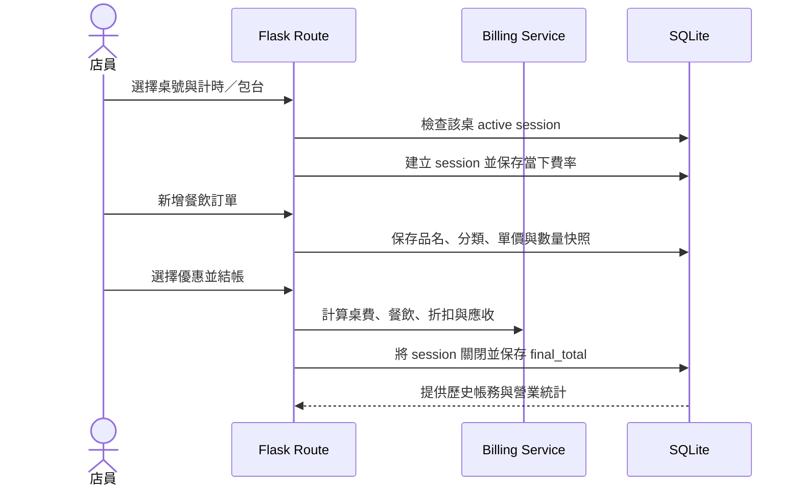

# Billiard Hall Management System

一套以 Flask、Jinja2 與 SQLite 開發的撞球館營運管理系統，將球檯計費、餐飲點單、預約、排班與財務統計整合在同一個操作介面。

> Portfolio project for demonstrating server-side web development, relational database design, business-rule implementation, and automated regression testing.

## 專案目標

撞球館的日常營運通常同時涉及球檯時間、不同計費方式、餐飲訂單、預約、員工排班與每日收支。如果分散記錄，容易發生漏單、計費不一致或無法追蹤歷史資料。

本專案希望解決以下問題：

- 即時掌握每張球檯的開關台狀態與使用時間。
- 支援計時、包台、加時、餐飲及多種優惠規則的結帳流程。
- 保留費率、餐點名稱與價格快照，避免修改設定後影響歷史帳務。
- 集中管理球檯預約、館內事件、待辦事項與員工班表。
- 將系統營收、人工實收與支出分開記錄，產生每日及每月營運資料。

## 系統畫面

### 球檯總覽



### 開台、點餐與結帳



### 行事曆與預約



### 員工班表



### 營業統計



截圖使用 `scripts/seed_demo.py` 產生的虛構資料，不包含正式資料庫或真實個資。

## 主要功能

| 模組 | 功能 |
| --- | --- |
| 球檯管理 | 自訂桌數、計時開台、包台、倒數、快速加時及同桌重複開台保護 |
| 計費與優惠 | 每桌獨立費率、百分比折扣、固定包台優惠價、優惠時段與折扣套用範圍 |
| 餐飲點單 | 分類選餐、飲料甜度與冰塊、數量、出餐狀態、刪除未結帳訂單 |
| 菜單管理 | 類別與品項新增、修改、停用，保留歷史訂單快照 |
| 行事曆／預約 | 球檯時段衝突檢查、重複預約、維修／活動／比賽及無日期待辦 |
| 員工排班 | 自訂員工與班別、批次多日排班、跨午夜班次、衝突檢查、PNG 匯出 |
| 營業統計 | 指定日期營收、折扣後實收、每小時開台筆數及結帳明細 |
| 收支管理 | 系統營收、人工實收、支出分類、每日收支淨額及 UTF-8 CSV 月報 |
| 安全清除 | 清除測試營運資料前檢查開台狀態、多重確認並自動備份 SQLite |

## 技術棧

- **Backend:** Python、Flask、Blueprint、Application Factory
- **Frontend:** HTML、CSS、Jinja2、Vanilla JavaScript、Canvas
- **Database:** SQLite、SQL constraints、foreign keys、partial unique index
- **Testing:** Python `unittest`、Flask test client、temporary SQLite database
- **Architecture:** Server-side rendering、service layer、feature-based Blueprint modules

## 系統架構



### 專案結構

```text
app.py                         # 程式啟動入口
billiard_app/
├── __init__.py                # Application Factory 與 Blueprint 註冊
├── config.py                  # 常數、預設設定及初始菜單
├── db.py                      # SQLite 連線、初始化及 schema migration
├── schema.sql                 # 資料表、constraint 與 index
├── blueprints/
│   ├── tables.py              # 開台、加時、點餐及結帳
│   ├── menu.py                # 菜單 CRUD
│   ├── reservations.py        # 預約、行事曆及待辦
│   ├── shifts.py              # 員工、班別及排班
│   ├── stats.py               # 營業統計
│   ├── finance.py             # 實收、支出及 CSV 月報
│   └── settings.py            # 費率、優惠與資料清除
└── services/
    ├── billing.py             # 計時、包台與折扣共用邏輯
    └── scheduling.py          # 月曆與跨日時間處理
templates/                     # Jinja2 HTML templates
static/style.css               # 響應式介面樣式
scripts/seed_demo.py           # 建立不含個資的展示資料庫
tests/test_app.py              # 自動化 regression tests
docs/screenshots/              # README 展示畫面
```

## Database ER Diagram



## 主要資料流程

### 開台到結帳



### 歷史快照設計

- 開台時將當下的每分鐘或每小時費率寫入 `sessions`。
- 點餐時將品名、分類、單價與小計寫入 `orders`。
- 結帳時保存折扣名稱、折扣方式、折扣金額與 `final_total`。
- 即使之後修改菜單、費率或優惠，歷史營收仍能按照當時資料還原。

## 資料完整性設計

- `CHECK` constraints 限制費率、價格、狀態與時間格式。
- SQLite foreign keys 維護菜單、訂單、員工與班別關係。
- Partial unique index 保證同一桌最多只有一筆 `active` session。
- 預約與排班在寫入前執行時段重疊檢查。
- 測試資料清除使用 transaction，並在刪除前以 SQLite backup API 建立完整備份。

## 測試

```bash
python -m unittest discover -v
```

目前共有 **17 項自動化測試**，測試使用暫存 SQLite，不會修改正式的 `billiard.db`。涵蓋範圍包括：

- 開台、點餐、折扣與結帳完整流程。
- 同桌重複開台的 application 與 database 雙層保護。
- 1 秒、60 秒及 61 秒的分鐘進位邊界。
- 包台到期後加時及更新倒數與費用。
- 跨午夜優惠與跨日班別。
- 預約及排班衝突的原子性。
- 菜單、班別、員工、行事曆與財務操作。
- 重複結帳不會改寫已完成交易。
- 測試資料清除會保留系統設定並建立備份。

## 安裝與啟動

需求：Python 3.10 以上。

```bash
git clone <repository-url>
cd billiard
python -m venv .venv
```

Windows PowerShell：

```powershell
.venv\Scripts\Activate.ps1
python -m pip install -r requirements.txt
python app.py
```

macOS / Linux：

```bash
source .venv/bin/activate
python -m pip install -r requirements.txt
python app.py
```

瀏覽器開啟 <http://127.0.0.1:5000>。終端機需要保持執行；第一次啟動會自動建立 `billiard.db`。

### 建立展示資料

```bash
python scripts/seed_demo.py demo.db
```

`demo.db` 只包含虛構資料，且所有 `.db`、備份與快取檔案皆由 `.gitignore` 排除。

## 技術選擇

| 選擇 | 原因 |
| --- | --- |
| Flask + Jinja2 SSR | 系統以館內管理操作為主，不需要 SPA 的額外複雜度 |
| Application Factory | 測試可替換暫存資料庫，啟動設定也不綁定全域 app |
| Blueprint | 依球檯、菜單、預約、班表、財務等功能拆分 routes |
| SQLite | 單一場館、低併發情境部署簡單，且支援 transaction 與 constraint |
| Service layer | 將計費與排程邏輯從 HTTP route 抽離，方便重用及邊界測試 |
| Server-side snapshots | 保存交易當下資料，避免設定變更破壞歷史帳務 |

## 面試可說明的技術亮點

1. **資料一致性：** 不只在 Flask route 檢查重複開台，也使用 partial unique index 從資料庫層阻止競態條件。
2. **歷史資料設計：** 訂單保存 `item_name`、`item_category_name`、`unit_price`，session 保存費率與折扣快照。
3. **複雜時間規則：** 支援包台倒數、分鐘進位、跨午夜優惠及隔日凌晨班別衝突判斷。
4. **安全資料清除：** 使用 transaction、多重確認、開台檢查與刪除前備份降低誤刪風險。
5. **可測試架構：** Application Factory 可注入暫存 database，17 項 regression tests 不會污染正式資料。

## 已知限制與後續規劃

- 尚未加入登入、角色權限與 CSRF 保護，不應直接暴露於公開網路。
- `app.py` 使用 Flask development server；正式部署應改用 Waitress 或其他 WSGI server。
- 金額目前使用 SQLite `REAL` 與 Python `float`，未來將遷移成整數最小單位或 `Decimal`。
- SQLite 適合目前的單店低併發情境；若擴充多分店或多機部署，應評估 PostgreSQL。
- 正式環境必須透過 `SECRET_KEY` 環境變數設定不可預測的金鑰，並建立定期異地備份。

## 無法連線排查

出現 `ERR_CONNECTION_REFUSED` 通常表示 Flask 尚未啟動，或啟動後因錯誤停止。請在專案目錄執行：

```powershell
python app.py
```

確認終端機顯示：

```text
Running on http://127.0.0.1:5000
```

如果系統找不到 `pip`，請改用：

```powershell
python -m pip install -r requirements.txt
```
