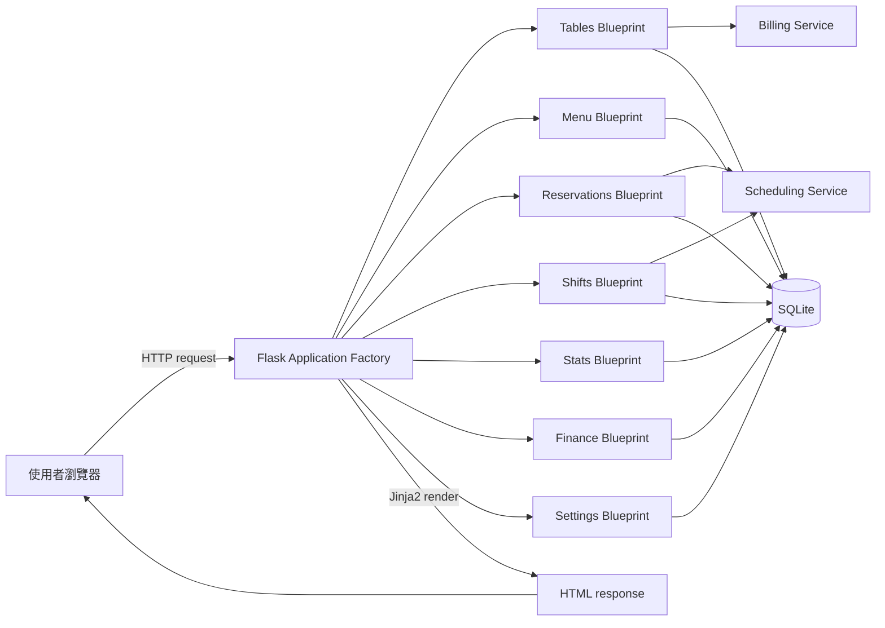
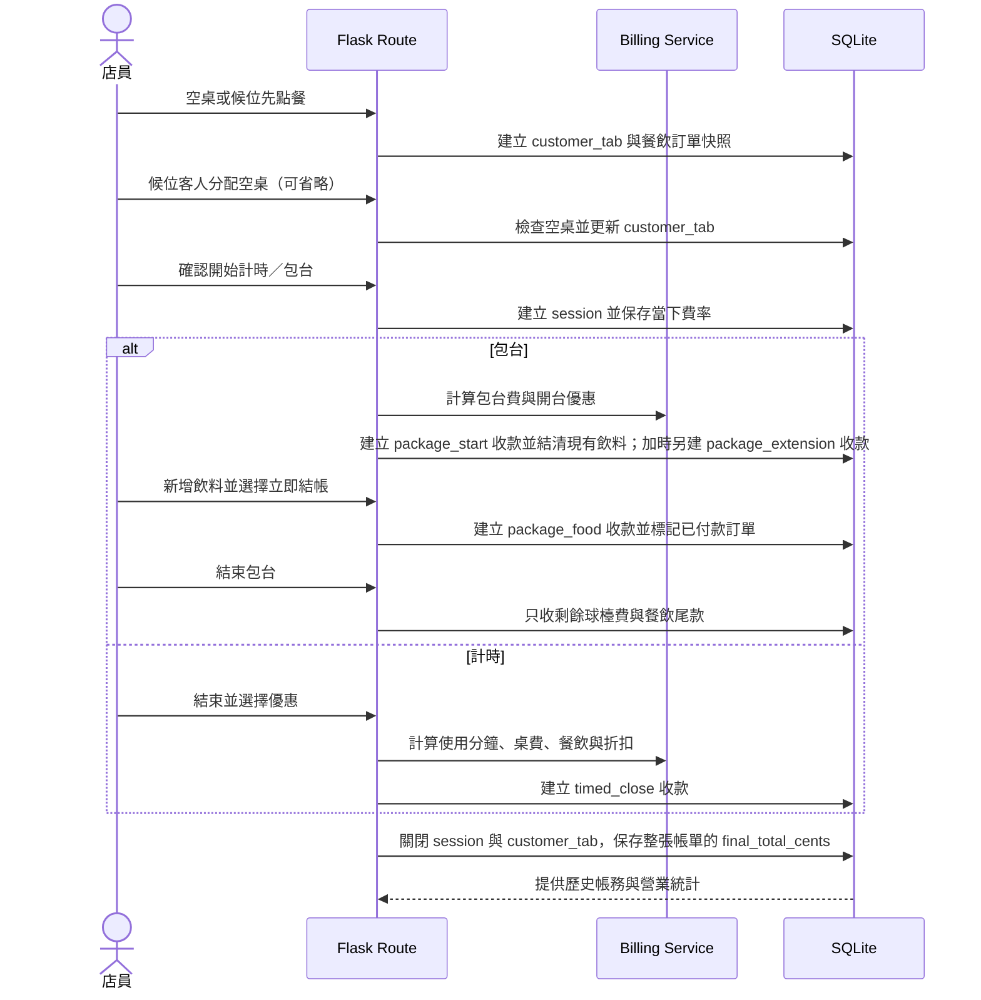

# Billiard Hall Management System

[](https://github.com/cloud-sky-0128/billiard-management-system/actions/workflows/tests.yml)

一套以 Flask、Jinja2 與 SQLite 開發的撞球館營運管理系統，將球檯計費、餐飲點單、預約、排班與財務統計整合在同一個操作介面。

> Portfolio project for demonstrating server-side web development, relational database design, business-rule implementation, and automated regression testing.

## 專案目標

撞球館的日常營運通常同時涉及球檯時間、不同計費方式、餐飲訂單、預約、員工排班與每日收支。如果分散記錄，容易發生漏單、計費不一致或無法追蹤歷史資料。

本專案希望解決以下問題：

- 即時掌握每張球檯的開關台狀態與使用時間。
- 支援計時、包台、加時、餐飲及多種優惠規則的結帳流程。
- 保留費率、餐點名稱與價格快照，避免修改設定後影響歷史帳務。
- 集中管理球檯預約、館內事件、待辦事項與員工班表。
- 將系統營收、人工實收與支出分開記錄，產生每日及每月營運資料。

## 系統畫面

### 球檯總覽


### 開台、點餐與結帳


### 行事曆與預約


### 員工班表


### 營業統計


截圖使用 `scripts/seed_demo.py` 產生的虛構資料，不包含正式資料庫或真實個資。

## 主要功能

| 模組 | 功能 |
| --- | --- |
| 球檯管理 | 自訂桌數與名稱、計時與包台、換桌、免費練習、倒數、快速加時、分次結帳及同桌重複開台保護 |
| 候位消費單 | 未分桌先點餐、保留餐點後分配空桌、手動開始計時或只結餐飲費 |
| 計費與優惠 | 每桌獨立費率、百分比折扣、固定包台優惠價、優惠時段與折扣套用範圍 |
| 餐飲點單 | 分類選餐、飲料甜度與冰塊、數量、出餐狀態、刪除未結帳訂單 |
| 菜單管理 | 類別與品項新增、修改、停用，保留歷史訂單快照 |
| 行事曆／預約 | 球檯時段衝突檢查、跨午夜與未填結束時間的預約、維修／活動／比賽及無日期待辦 |
| 員工排班 | 自訂員工與班別、批次多日排班、跨午夜班次、衝突檢查、全體或個人班表 PNG 匯出 |
| 營業統計 | 依營業日區分計價原價與實際已收、每小時開台筆數及結帳明細，支援跨午夜歸帳 |
| 收支管理 | 系統收款、整元人工實收與支出、每日收支淨額，以及月報與支出明細 CSV |
| 資料保護 | 啟動時及運行中自動備份、快照健康檢查、安全清除測試資料與精簡操作紀錄 |

## 技術棧

- **Backend:** Python、Flask、Blueprint、Application Factory
- **Frontend:** HTML、CSS、Jinja2、Vanilla JavaScript、Canvas
- **Database:** SQLite、SQL constraints、foreign keys、partial unique index
- **Testing:** Python `unittest`、Flask test client、temporary SQLite database
- **Desktop packaging:** Waitress、PyInstaller、GitHub Actions
- **Architecture:** Server-side rendering、service layer、feature-based Blueprint modules

## 系統架構



### 專案結構

```text
app.py                         # 程式啟動入口
billiard_app/
├── __init__.py                # Application Factory 與 Blueprint 註冊
├── config.py                  # 常數、預設設定及初始菜單
├── db.py                      # SQLite 連線、初始化及 schema migration
├── audit.py                   # 高風險操作紀錄
├── maintenance.py             # 完整備份、快照輪替與健康檢查
├── security.py                # CSRF 與來源檢查
├── schema.sql                 # 資料表、constraint 與 index
├── blueprints/
│   ├── tables.py              # 開台、加時、點餐及結帳
│   ├── menu.py                # 菜單 CRUD
│   ├── reservations.py        # 預約、行事曆及待辦
│   ├── shifts.py              # 員工、班別及排班
│   ├── stats.py               # 營業統計
│   ├── finance.py             # 實收、支出及 CSV 月報
│   └── settings.py            # 費率、優惠與資料清除
└── services/
    ├── billing.py             # 計時、包台與折扣共用邏輯
    ├── business_day.py        # 跨午夜營業日邊界與日期歸屬
    └── scheduling.py          # 月曆與跨日時間處理
templates/                     # Jinja2 HTML templates
static/style.css               # 響應式介面樣式
scripts/seed_demo.py           # 建立不含個資的展示資料庫
tests/test_app.py              # 自動化 regression tests
tests/test_hardening.py        # 安全與邊界回歸測試
docs/screenshots/              # README 展示畫面
```

## Database ER Diagram

```mermaid
erDiagram
    categories ||--o{ menu_items : contains
    customer_tabs ||--o{ orders : contains
    customer_tabs ||--o| sessions : starts
    customer_tabs ||--o{ payments : pays
    sessions ||--o{ payments : records
    discount_types o|--o{ sessions : applied_to
    employees o|--o{ shifts : assigned_to
    shift_types o|--o{ shifts : classifies

    categories {
        INTEGER id PK
        TEXT name UK
        INTEGER is_active
    }
    menu_items {
        INTEGER id PK
        INTEGER category_id FK
        TEXT name
        INTEGER price_cents
        INTEGER is_active
    }
    table_rates {
        INTEGER table_no PK
        INTEGER timed_rate_per_min_cents
        INTEGER package_rate_per_hour_cents
        INTEGER package_enabled
    }
    discount_types {
        INTEGER id PK
        TEXT name UK
        TEXT pricing_method
        REAL discount_percent
        INTEGER package_rate_per_hour_cents
        TEXT applicable_mode
        TEXT discount_scope
    }
    sessions {
        INTEGER id PK
        INTEGER customer_tab_id FK
        INTEGER table_no
        TEXT mode
        TEXT start_time
        TEXT end_time
        TEXT status
        INTEGER rate_per_min_cents
        INTEGER rate_per_hour_cents
        INTEGER final_total_cents
        INTEGER discount_type_id FK
    }
    orders {
        INTEGER id PK
        INTEGER customer_tab_id FK
        INTEGER session_id FK
        INTEGER item_id
        TEXT item_name
        TEXT item_category_name
        INTEGER unit_price_cents
        INTEGER quantity
        INTEGER subtotal_cents
        INTEGER payment_id FK
    }
    customer_tabs {
        INTEGER id PK
        TEXT display_name
        INTEGER guest_count
        INTEGER table_no
        TEXT status
        TEXT opened_at
        TEXT closed_at
        INTEGER final_total_cents
    }
    payments {
        INTEGER id PK
        INTEGER customer_tab_id FK
        INTEGER session_id FK
        TEXT payment_type
        INTEGER table_fee_cents
        INTEGER food_fee_cents
        INTEGER discount_amount_cents
        INTEGER amount_cents
        TEXT paid_at
    }
    reservations {
        INTEGER id PK
        INTEGER table_no
        TEXT guest_name
        TEXT start_time
        TEXT end_time
        TEXT status
    }
    calendar_items {
        INTEGER id PK
        TEXT title
        TEXT item_type
        TEXT scheduled_date
        TEXT status
    }
    employees {
        INTEGER id PK
        TEXT name UK
        TEXT color
        INTEGER is_active
    }
    shift_types {
        INTEGER id PK
        TEXT name UK
        TEXT start_time
        TEXT end_time
        INTEGER ends_next_day
    }
    shifts {
        INTEGER id PK
        INTEGER employee_id FK
        INTEGER shift_type_id FK
        TEXT staff_name
        TEXT shift_type_name
        TEXT start_time
        TEXT end_time
    }
    daily_cash_records {
        TEXT record_date PK
        INTEGER actual_revenue_cents
        TEXT note
    }
    expenses {
        INTEGER id PK
        TEXT expense_date
        TEXT category
        TEXT description
        INTEGER amount_cents
    }
    settings {
        TEXT key PK
        TEXT value
    }
```



## 主要資料流程

### 點餐、分桌到結帳



若客人沒有打球，候位或待開台消費單可以直接只結餐飲費，不產生 `sessions`。
球檯總覽的時段圖仍統計實際開台筆數，不把候位或待開台算入。

### 歷史快照設計

- `customer_tabs` 保存客人的帳單生命週期，`sessions` 只保存真正開始打球的球檯時間。
- 開台時將當下的每分鐘或每小時費率寫入 `sessions`。
- 點餐時將品名、分類、單價與小計寫入 `orders`。
- 結帳時保存折扣名稱、折扣方式、折扣金額與 `final_total_cents`。
- `payments` 保存每一次實際收款；包台開台與加時先收球檯費，計時則在結束時收款。
- `orders.payment_id` 將餐飲連到實際收款，避免分次結帳後在關台時重複收費。
- 即使之後修改菜單、費率或優惠，歷史營收仍能按照當時資料還原。
- 所有金額皆以整數分（`*_cents`）保存，輸入時使用 `Decimal` 四捨五入，避免浮點數累積誤差。
- 實際收款在入帳前四捨五入為整元；報表以實收紀錄計算，不另設整元調整欄位。

## 資料完整性設計

- `CHECK` constraints 限制費率、價格、狀態與時間格式。
- SQLite foreign keys 維護菜單、訂單、員工與班別關係。
- Partial unique index 保證同一桌最多只有一筆進行中消費單與一筆 `active` session。
- 候位分桌與開台使用 `BEGIN IMMEDIATE`，避免兩位員工同時占用同一桌。
- 預約與排班以 `BEGIN IMMEDIATE` 將時段重疊檢查與寫入包在同一筆 transaction，避免並行請求重複建立。
- 測試資料清除使用 transaction，並在刪除前以 SQLite backup API 建立完整備份。

## 測試

```bash
python -m unittest discover -s tests -v
```

目前共有 **101 項自動化測試**，測試使用暫存 SQLite，不會修改正式的 `billiard.db`。涵蓋範圍包括：

- 開台、點餐、折扣與結帳完整流程。
- 同桌重複開台的 application 與 database 雙層保護。
- 1 秒、60 秒及 61 秒的分鐘進位邊界。
- 包台到期後加時及更新倒數與費用。
- 包台預收、加時預收、餐飲尾款與計時後結不會重複收費。
- 包台開台合併飲料收款，以及包台中新增飲料立即結帳。
- 跨午夜優惠與跨日班別。
- 每日 06:00 的營業日邊界及跨月歸帳。
- 預約及排班衝突的原子性與並行請求測試。
- 整數分儲存、十進位四捨五入與百分比折扣測試。
- 菜單、班別、員工、行事曆與財務操作。
- 重複結帳不會改寫已完成交易。
- 測試資料清除會保留系統設定並建立備份。
- 每日／每月備份保留期限、每月首份快照與手動備份保護。

## 營業日規則

- 每個營業日皆於隔日 `06:00` 結束，避免凌晨延長營業時被拆到下一天。
- 例如 `2026-09-23 05:59` 的收款仍屬於 `2026-09-22` 營業日；`2026-09-23 06:00` 起才屬於 `2026-09-23` 營業日。
- 營業統計、系統營收與月報都使用同一套規則。人工實收及支出則由使用者直接選擇要登記的營業日。
- 收支管理可下載整月月報及整月支出明細，格式皆為含 UTF-8 BOM 的 CSV，可直接使用 Excel 開啟。

## 安裝與啟動

需求：Python 3.10 以上。

```bash
git clone https://github.com/cloud-sky-0128/billiard-management-system.git
cd billiard-management-system
python -m venv .venv
```

Windows PowerShell：

```powershell
.venv\Scripts\Activate.ps1
python -m pip install -r requirements.txt
python app.py
```

macOS / Linux：

```bash
source .venv/bin/activate
python -m pip install -r requirements.txt
python app.py
```

瀏覽器開啟 <http://127.0.0.1:5000>。終端機需要保持執行；第一次啟動會自動建立 `billiard.db`。
若偵測到舊版金額欄位或舊的開台／訂單結構，啟動時會先將原資料庫備份到 `backups/`，再遷移資料。

### 資料備份與復原

- 系統啟動時建立當天第一份備份，並立即建立日內快照；持續執行時每 15 分鐘建立新快照，換日後另建每日備份。程式關閉時不會執行排程。備份使用 SQLite backup API，先驗證完整性；每日備份為 `backups/billiard-daily-YYYY-MM-DD.db`，日內快照為 `backups/billiard-recent-YYYYMMDD-HHMMSS-ffffff.db`。重要操作前仍可到「整體設定 > 資料保護」手動建立額外備份。
- 每份備份都是建立當下的完整 SQLite 資料庫，包含設定、球檯、消費單、訂單、收款、實收、支出、預約、班表及操作紀錄；不是只備份當天變更。每日檔只保留該日第一份狀態，不會每 15 分鐘覆寫；日內變更由獨立的 15 分鐘快照保存。備份也含客戶資料及管理員密碼雜湊，應限制檔案存取權限。
- 自動備份會保留最近 16 份日內快照、30 天的每日備份，以及最近 12 個月每月首次成功建立的備份。過期的自動備份會清除；手動備份、資料遷移前備份及清除測試資料前備份不會被這項規則刪除。第二備份位置使用相同規則。
- 同一磁碟上的備份不能防止硬碟故障。Windows 可在啟動程式前設定 `BILLIARD_BACKUP_DIR` 為另一顆磁碟或外接硬碟，例如 PowerShell 執行 `$env:BILLIARD_BACKUP_DIR='E:\BilliardBackups'` 後，再從同一視窗啟動程式。沒有設定時只備份到資料庫旁的 `backups/`。第二位置無法寫入時會在設定頁顯示警告，請勿忽略。外接硬碟應定期確認仍可連線。
- 「執行還原演練」會把選定備份複製到暫存資料庫並檢查完整性、外鍵及核心資料表；**不會覆蓋正式資料**。請定期選一份備份測試。
- 啟動時會檢查既有 SQLite 資料庫；資料庫損壞會阻止啟動。設定頁會檢查今日備份及最新日內快照（不存在、損壞或超過 30 分鐘未更新時警告），也會提醒磁碟可用空間低於 200 MB；第二備份位置如有設定亦會檢查。程式錯誤記錄在資料庫旁 `logs/app.log`（輪替保存）。手動備份不會自動刪除，仍應監看磁碟空間。
- 升級前先在設定頁按「立即建立備份」，執行還原演練並記下備份檔路徑；**關閉程式後**再更新 EXE。要回退時，先關閉程式，另存目前 `billiard.db`，再把升級前的備份複製回 `billiard.db`，最後啟動相容的舊版程式。還原會丟失備份之後的新資料，且舊版程式不保證讀得懂新版 schema；不要在程式執行中直接覆蓋 DB。若有疑慮，先複製整個資料目錄並在另一個位置演練。
- 斷電／強制關閉時，SQLite 會在下次開啟時回滾未提交的交易；**已提交但晚於最後備份的資料，仍需從正式 DB 恢復，備份不能代替同步儲存**。測試涵蓋未提交交易中斷後的回滾與備份還原，不等於真實硬體斷電測試。

## 讓朋友測試

### 方法一：下載 Windows 免安裝版（推薦）

朋友不需要安裝 Python 或 Git：

1. 前往 [GitHub Releases](https://github.com/cloud-sky-0128/billiard-management-system/releases/latest)。
2. 下載 `BilliardManager-windows-x64.zip`。
3. 對 ZIP 選擇「解壓縮全部」，不要直接在壓縮檔裡執行。
4. 進入解壓縮後的 `BilliardManager` 資料夾。
5. 雙擊 `BilliardManager.exe`，瀏覽器會自動開啟管理系統。

程式執行期間需保留黑色視窗；關閉視窗就會停止系統。Windows 第一次執行可能出現 SmartScreen 警告，請先確認檔案來自本專案的 GitHub Releases，再選擇「其他資訊」及「仍要執行」。

每台電腦的資料預設獨立保存在 `%LOCALAPPDATA%\BilliardManager\billiard.db`。僅首次建立資料庫且該位置無法寫入時，才改用解壓縮資料夾內的 `BilliardManager\data`。後續啟動會沿用已存在的資料庫；若兩處都有資料庫，程式會拒絕自行選擇，須先核對資料並用 `BILLIARD_DATABASE` 指定正式路徑。替換成新版程式時，若先前使用 `data`，務必一併保留該資料夾；完整說明也包含在 ZIP 的 `README.txt`。

### 方法二：朋友從原始碼執行

每台電腦會建立自己的 `billiard.db`，不會修改你的資料。

朋友先安裝 [Python 3](https://www.python.org/downloads/) 與 [Git](https://git-scm.com/downloads)，再開啟 PowerShell 執行：

```powershell
git clone https://github.com/cloud-sky-0128/billiard-management-system.git
cd billiard-management-system
py -m venv .venv
.venv\Scripts\python.exe -m pip install -r requirements.txt
.venv\Scripts\python.exe app.py
```

看到以下訊息代表啟動成功：

```text
Running on http://127.0.0.1:5000
```

接著在同一台電腦的瀏覽器開啟 <http://127.0.0.1:5000>。測試期間不要關閉 PowerShell；要停止伺服器時按 `Ctrl+C`。

如果系統找不到 `py`，將上述指令中的 `py` 改成 `python`。

### 方法三：同一個 Wi-Fi 連到你的電腦

這種方式會共用你電腦上的同一份資料庫。測試前建議先備份 `billiard.db`，而且只允許信任的朋友連線。

1. 確認你和朋友的電腦連到相同 Wi-Fi。
2. 如果原本已經執行 `python app.py`，先在該 PowerShell 按 `Ctrl+C` 停止。
3. 在專案目錄執行：

```powershell
.venv\Scripts\python.exe -m flask --app app run --host=0.0.0.0 --port=5000
```

4. Windows 防火牆詢問時，只允許「私人網路」。
5. 另外開啟一個 PowerShell，查詢你的區域網路 IP：

```powershell
ipconfig
```

在 Wi-Fi 網路介面找到 `IPv4 Address`，例如 `192.168.1.100`。朋友的瀏覽器應開啟：

```text
http://192.168.1.100:5000
```

請把範例 IP 換成你實際查到的 IPv4。`0.0.0.0` 只是伺服器監聽設定，不是瀏覽器網址。

目前只有管理員密碼保護部分後台操作，尚無個別員工帳號與細分權限。請勿設定路由器 Port Forwarding，也不要直接將此開發伺服器公開到網際網路。

### 朋友無法連線時

- 確認主機的 PowerShell 仍顯示伺服器正在執行。
- 確認雙方使用相同 Wi-Fi，且不是會隔離裝置的訪客網路。
- 確認網址使用 `http://`，不是 `https://`。
- 重新執行 `ipconfig`，確認主機的 IPv4 沒有改變。
- 確認 Windows 防火牆已允許 Python 使用私人網路。
- 主機可以先開啟 <http://127.0.0.1:5000>，確認程式本身正常。

### 建置 Windows 免安裝版

開發者需要在 Windows 安裝建置相依套件：

```powershell
python -m pip install -r requirements-build.txt
```

執行建置腳本：

```powershell
powershell -ExecutionPolicy Bypass -File scripts\build_windows.ps1
```

完成後的分享檔案位於：

```text
dist\BilliardManager-windows-x64.zip
```

推送 `v*` 格式的 Git tag 時，GitHub Actions 也會自動執行測試、建立 Windows ZIP 並發布至 GitHub Releases。
一般 `git push` 只會更新原始碼；若要讓朋友從 Releases 下載新 ZIP，需要另行建立並推送版本標籤。
本機打包與 GitHub Actions 使用的腳本會重建 `build/` 和標準版 `dist/` 產物；若要保留舊包，請先另存。

### 建立展示資料

```bash
python scripts/seed_demo.py demo.db
```

`demo.db` 只包含虛構資料，且所有 `.db`、備份與快取檔案皆由 `.gitignore` 排除。

## 技術選擇

| 選擇 | 原因 |
| --- | --- |
| Flask + Jinja2 SSR | 系統以館內管理操作為主，不需要 SPA 的額外複雜度 |
| Application Factory | 測試可替換暫存資料庫，啟動設定也不綁定全域 app |
| Blueprint | 依球檯、菜單、預約、班表、財務等功能拆分 routes |
| SQLite | 單一場館、低併發情境部署簡單，且支援 transaction 與 constraint |
| Service layer | 將計費與排程邏輯從 HTTP route 抽離，方便重用及邊界測試 |
| Server-side snapshots | 保存交易當下資料，避免設定變更破壞歷史帳務 |
| Integer cents + Decimal | 金額以整數分保存，避免 SQLite `REAL` 與 Python `float` 的精度誤差 |

## 面試可說明的技術亮點

1. **資料一致性：** 重複開台使用 partial unique index；預約與排班用 immediate transaction 將查核及寫入原子化，阻止競態條件。
2. **歷史資料設計：** 訂單保存 `item_name`、`item_category_name`、`unit_price_cents`，session 保存費率與折扣快照。
3. **複雜時間規則：** 支援包台倒數、分鐘進位、跨午夜優惠及隔日凌晨班別衝突判斷。
4. **安全資料清除：** 使用 transaction、多重確認、開台檢查與刪除前備份降低誤刪風險。
5. **可測試架構：** Application Factory 可注入暫存 database，回歸測試不會污染正式資料。
6. **金額精度：** schema 使用整數分，表單金額由 `Decimal` 轉換，並提供自動備份的舊資料遷移。

## 已知限制與後續規劃

- 後台已有管理員密碼與 CSRF 保護，但尚無員工個別帳號及細分角色權限，不應直接暴露於公開網路。
- 操作紀錄可協助追查刪單、實收修改、刪支出與清除資料，但共用管理員登入無法辨識個別員工，本機資料庫也不是防竄改稽核系統。
- 目前尚未接入實體燈控設備；免費練習僅記錄球檯使用狀態，不會直接控制燈具。
- 原始碼的 `app.py` 使用 Flask development server；Windows 免安裝版則使用 Waitress。公開部署仍需獨立的正式環境。
- SQLite 適合目前的單店低併發情境；若擴充多分店或多機部署，應評估 PostgreSQL。
- 若要正式營運，仍需設定 `SECRET_KEY`，並定期檢查第二備份位置、容量及真正的還原流程。

## 無法連線排查

出現 `ERR_CONNECTION_REFUSED` 通常表示 Flask 尚未啟動，或啟動後因錯誤停止。請在專案目錄執行：

```powershell
python app.py
```

確認終端機顯示：

```text
Running on http://127.0.0.1:5000
```

如果系統找不到 `pip`，請改用：

```powershell
python -m pip install -r requirements.txt
```
