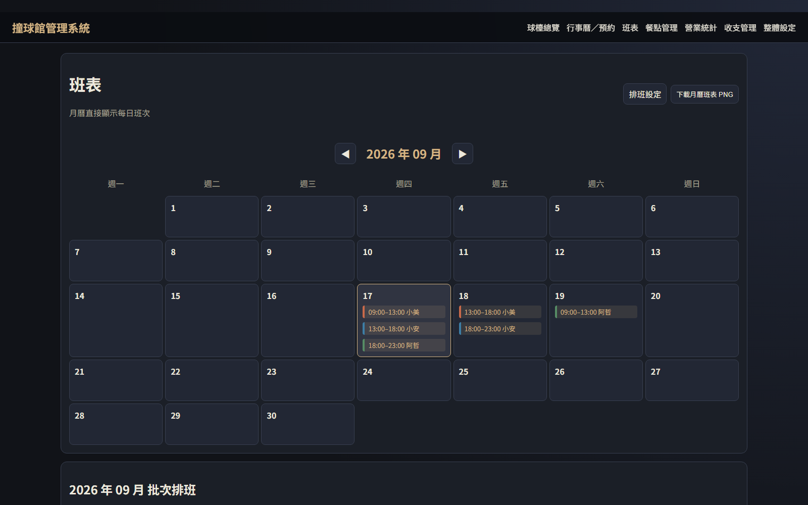

# 撞球館管理系統

[](https://github.com/cloud-sky-0128/billiard-management-system/actions/workflows/tests.yml)

以單店實際營運流程為核心的撞球館管理系統，整合球檯計費、餐飲點單、預約、員工班表、每日收支與備份。系統可在 Windows 單機離線使用，免安裝版不需要另外安裝 Python。

## 專案背景與動機

我本身對撞球有興趣，也觀察到不少球館仍在使用年代較久的計時收銀介面，或依賴與特定硬體綁定的封閉式控制台。這些工具能完成基本計費，但當店家想調整費率、包台方式、預約、班表或收支流程時，往往不容易依照自己的營運方式修改；遇到異常時，資料位置、備份方式及問題排查也不夠透明。

剛好我的朋友是球館股東，因此我以他們球館的實際使用情境作為需求來源，從開桌、包台、換桌、點餐、結帳，到預約、排班與每日對帳逐步整理流程並實作。這個專案不只是展示 CRUD 頁面，而是嘗試把真實店務規則轉成可以驗證、備份及持續修改的軟體。

目前版本已能以非營業資料完成主要流程與 Windows 打包驗收，但尚未在球館正式營運。下一階段希望取得有線燈控協議並完成硬體隔離與現場測試，讓系統能實際控制每張球檯的燈具，再由球館進行試營運驗收。

### 我的實作範圍

這是由我主導的個人專案。我負責把球館使用情境整理成需求與驗收條件、設計操作流程與資料模型、整合前後端功能，並建立自動化測試、Windows 打包及版本發布流程。開發過程特別關注金額一致性、重複操作、資料備份、安全邊界及舊資料升級，而不只追求畫面與功能數量。


## 想解決的問題

| 現場需求 | 本專案的處理方式 |
| --- | --- |
| 計時、包台及優惠規則會依球館而不同 | 每桌獨立費率、計時／包台、加時、換桌、折扣及優惠時段 |
| 球檯費與餐飲容易分散紀錄 | 將球檯狀態、點餐、分次收款及最終結帳整合在同一筆消費流程 |
| 預約、班表及收支常分散在不同工具 | 整合預約行事曆、員工排班、每日實收、支出與月報匯出 |
| 單店不一定適合依賴雲端或持續連線 | 只監聽本機 `127.0.0.1`，使用 SQLite，斷網後仍可操作 |
| 異常或更新時可能找不到資料、也不知道備份是否可用 | 固定資料路徑、自動快照、備份健康檢查、還原演練及操作紀錄 |
| 現有燈控設備協議封閉，軟體難以直接替換 | 先完成可獨立驗證的店務軟體；待取得有線協議後再設計硬體控制層 |

## 工程實作重點

| 面向 | 實作與驗證 |
| --- | --- |
| 架構 | Flask Application Factory、Blueprint 分模組、Service 層集中營業日、排程與計費規則 |
| 資料正確性 | SQLite、整數分保存金額、`Decimal` 計算、交易控制與操作識別碼防止重複送出 |
| 安全性 | CSRF、可信 Host、Session 失效、輸入範圍檢查、CSV 公式注入防護及精簡操作紀錄 |
| 可靠性 | 啟動時備份、每日備份、15 分鐘快照、完整性檢查、資料遷移前備份及不覆蓋正式資料的還原演練 |
| 測試 | 超過 100 項 `unittest`，涵蓋計費、跨午夜、預約衝突、權限、備份、資料遷移及異常輸入 |
| 交付 | PyInstaller 建置瀏覽器版與 WebView2 獨立視窗版，GitHub Actions 自動測試、打包與發布 SHA-256 |

更完整的設計取捨、資料流程與核心資料表整理在 [技術設計與資料模型](docs/ARCHITECTURE.md)；下載版測試範圍及尚未完成的驗收項目則記錄在 [2026-10-07 下載版驗收報告](docs/DOWNLOAD_ACCEPTANCE_2026-10-07.md)。

## 目前狀態

| 項目 | 狀態 |
| --- | --- |
| 核心店務流程 | 已完成主要功能及自動化測試，可使用非營業資料操作 |
| Windows 瀏覽器版 | 已發布，為目前建議試用版本 |
| Windows 獨立視窗版 | 已發布預覽版，仍需補做乾淨電腦與 WebView2 情境驗收 |
| 實體燈控 | 尚未接入；免費練習功能目前只改變系統中的球檯狀態 |
| 球館正式運行 | 尚未上線；需完成燈控、現場壓力測試、實機備份還原及操作人員驗收 |

> 目前尚未連接實體燈控設備；「免費練習燈」只標示球檯使用中，不會控制燈具。程式只供本機存取，請勿直接公開到網際網路。

## Windows 版本怎麼選

| 版本 | 取得方式 | 啟動程式 | 操作方式與狀態 |
| --- | --- | --- | --- |
| **瀏覽器版 `v0.1.5-desktop`** | [已發布的 Release](https://github.com/cloud-sky-0128/billiard-management-system/releases/tag/v0.1.5-desktop) 中下載 `BilliardManager-windows-x64.zip` | `BilliardManager.exe` | 在本機瀏覽器操作；目前建議使用的已發布版本，不需 WebView2。 |
| **獨立視窗預覽版 `window-preview-0.1.2`** | [預覽版 Release](https://github.com/cloud-sky-0128/billiard-management-system/releases/tag/window-preview-0.1.2) 下載 `BilliardManagerWindow-preview.zip` | `BilliardManagerWindow.exe` | 在獨立視窗操作；需安裝 WebView2 Runtime，先以備份資料試用。 |
| **原始碼開發版（`main`）** | Clone 本倉庫並安裝 `requirements.txt` | `python app.py` | 在本機瀏覽器操作 `http://127.0.0.1:5000`；需 Python，不是 Windows 免安裝版。 |

前兩種 Windows 版都只在這台電腦的 `127.0.0.1:8765` 啟動本機服務，不必連線到網際網路；兩者不能同時執行。瀏覽器版會自動開啟該網址；獨立視窗版會直接顯示操作介面，使用者不必另外開瀏覽器或手動輸入網址。一般 `git push` 只更新原始碼，不會更新 Release ZIP。

對外提供 ZIP 前，請依 [Windows 下載版發布驗收清單](docs/DOWNLOAD_RELEASE_CHECKLIST.md) 用非營業資料及乾淨電腦逐項確認；不需要上架 Microsoft Store。

[2026-10-07 下載版驗收報告](docs/DOWNLOAD_ACCEPTANCE_2026-10-07.md) 記錄本次已通過的測試、重現的問題與待補實機驗收項目；目前尚未全部簽收。

### 啟動已發布的瀏覽器版

1. 前往 [`v0.1.5-desktop` 下載頁](https://github.com/cloud-sky-0128/billiard-management-system/releases/tag/v0.1.5-desktop)，下載 `BilliardManager-windows-x64.zip`。
2. 對 ZIP 選擇「解壓縮全部」，不要直接在壓縮檔內執行。
3. 進入解壓後的 `BilliardManager` 資料夾，雙擊 `BilliardManager.exe`。
4. 等待瀏覽器自動開啟 `http://127.0.0.1:8765`。使用期間請保留程式視窗；關閉視窗就會停止系統。

下載後可在 PowerShell 執行以下指令，將結果與同一個 GitHub Release 附件 `SHA256SUMS.txt` 比對：

```powershell
Get-FileHash -Algorithm SHA256 .\BilliardManager-windows-x64.zip
```

若 Windows 顯示 SmartScreen 警告，先確認下載來源與 SHA-256；不要執行來源不明或驗證結果不符的檔案。更多本機版說明見 [ZIP 內的 README 來源](docs/WINDOWS_PORTABLE.md)。

### 啟動或建置獨立視窗預覽版

一般使用者從 [視窗預覽版 Release](https://github.com/cloud-sky-0128/billiard-management-system/releases/tag/window-preview-0.1.2) 下載 `BilliardManagerWindow-preview.zip`，完整解壓後執行 `BilliardManagerWindow.exe`。程式會直接開啟獨立操作視窗，不需要手動開啟 `http://127.0.0.1:8765`。**不可把瀏覽器版 ZIP 誤認為視窗版**。

只有需要自行從原始碼建置時，才要在 Windows 安裝 Python 並於專案目錄執行：

```powershell
python -m pip install -r requirements-window.txt
powershell -NoProfile -ExecutionPolicy Bypass -File .\scripts\build_windows_window.ps1
```

使用前請先看 [視窗預覽版說明](docs/WINDOWS_WINDOW_PREVIEW.md)，尤其是 WebView2 Runtime、共用資料庫及 EXE 旁 `data` 的注意事項。

本次更新讓獨立視窗版可下載班表 PNG 與收支 CSV，並修正已過期預約仍阻擋縮減球檯數的問題。歷史預約會保留原桌號，不會因縮桌而刪除或改桌。

## 資料放在哪裡

| 類型 | 預設位置 |
| --- | --- |
| 正式資料庫 | `%LOCALAPPDATA%\BilliardManager\billiard.db` |
| 備份 | `%LOCALAPPDATA%\BilliardManager\backups\` |
| 錯誤日誌 | `%LOCALAPPDATA%\BilliardManager\logs\app.log` |

每台電腦各有自己的資料庫，解壓新版 ZIP 不會自動把舊電腦的資料搬過去。只有在首次建立資料庫且預設位置不可寫時，程式才會改用解壓資料夾內的 `BilliardManager\data`。之後會沿用已存在的資料庫；若預設位置與 `data` 都有資料庫，程式會停止啟動，避免無聲切換。這時請先核對兩份資料，不要任意刪除或覆蓋。

## 備份、升級與還原

- 程式啟動時會建立當日第一份完整備份及日內快照；持續執行時約每 15 分鐘建立新快照。程式關閉期間不會備份。
- 自動保留最近 16 份日內快照、30 天的每日備份，以及最近 12 個月每月首次成功建立的備份。每日備份只保留當天第一份狀態，不會被日內快照覆寫。
- 備份是當下完整的 SQLite 資料庫，包含設定、消費單、收款、預約、班表與操作紀錄；也可能包含客戶資料及管理員密碼雜湊，請妥善保管。
- 只備份在同一顆硬碟無法防止硬碟故障。可設定 `BILLIARD_BACKUP_DIR` 到另一顆磁碟；方式見 [Windows 免安裝版說明](docs/WINDOWS_PORTABLE.md)。

**升級前：** 到「整體設定 > 資料保護」手動建立備份並執行還原演練，確認備份可讀，再關閉舊程式。更新程式時不要覆蓋或刪除資料庫；如果舊版使用解壓資料夾內的 `data`，務必一起保留該資料夾。

**需要回退時：** 先關閉程式，另存目前資料庫，再把升級前的備份複製回原資料庫路徑。這會失去備份之後的新紀錄；舊版程式也不保證能讀取新版資料庫。不要在程式執行中覆蓋資料庫。

## 主要功能

| 模組 | 功能 |
| --- | --- |
| 球檯管理 | 自訂桌數與名稱、計時與包台、換桌、免費練習、加時及分次結帳 |
| 候位消費單 | 未分桌先點餐、分配空桌，或只結餐飲費 |
| 計費與優惠 | 每桌獨立費率、優惠時段、百分比折扣與包台優惠價 |
| 餐飲點單 | 分類選餐、飲料甜度與冰塊、數量及出餐狀態 |
| 行事曆／預約 | 球檯預約、跨午夜時段、維修／活動／比賽及無日期待辦 |
| 員工排班 | 自訂員工與班別、多日排班、跨午夜班次及個人班表 PNG 匯出 |
| 收支與統計 | 營業日統計、系統收款、人工實收、支出、月報及 CSV 匯出 |
| 資料保護 | 自動備份、快照健康檢查、安全清除測試資料及精簡操作紀錄 |

未填結束時間的球檯預約預設保留一小時。營業日以每日 `06:00` 為分界；例如 `2026-09-23 05:59` 的收款屬於 `2026-09-22` 營業日。實際收款、人工實收與支出均以整元處理；資料庫內部以整數分儲存金額，避免浮點數誤差。

## 系統畫面

以下截圖使用虛構展示資料，不包含正式資料庫或真實個資。

### 球檯細項


### 行事曆與預約


### 員工班表



### 營業統計


## 常見問題

- **瀏覽器版沒有自動開啟：** 確認 `BilliardManager.exe` 的黑色程式視窗仍在執行，再手動輸入 `http://127.0.0.1:8765`。原始碼開發版才使用 `http://127.0.0.1:5000`。
- **獨立視窗版需要開網址嗎：** 不需要。執行 `BilliardManagerWindow.exe` 後直接在程式視窗操作；`127.0.0.1:8765` 只是內部本機服務。
- **網址無法連線：** 這只適用於瀏覽器版；確認 `BilliardManager.exe` 的黑色程式視窗仍在執行，並確認連接埠是 `8765`。
- **啟動或備份失敗：** 查看資料庫旁的 `logs\app.log`，確認磁碟尚有空間、外接備份磁碟仍可使用。
- **資料看似消失：** 先停止操作並確認目前使用的資料庫路徑；不要建立新資料庫或覆蓋舊檔。

## 從原始碼執行（開發者）

需求：Python 3.10 以上。請先安裝 Python 與 Git，再執行：

```bash
git clone https://github.com/cloud-sky-0128/billiard-management-system.git
cd billiard-management-system
python -m venv .venv
```

Windows PowerShell：

```powershell
.\.venv\Scripts\python.exe -m pip install -r requirements.txt
.\.venv\Scripts\python.exe app.py
```

macOS / Linux：

```bash
.venv/bin/python -m pip install -r requirements.txt
.venv/bin/python app.py
```

瀏覽器開啟 `http://127.0.0.1:5000`。終端機需要保持執行；第一次啟動會建立專案目錄內的 `billiard.db`。此方式使用 Flask 開發伺服器，不應直接公開到網際網路。

### 測試與打包

```bash
python -m unittest discover -s tests -v
```

目前有**超過 100 項自動化測試**；測試使用暫存 SQLite，不會修改正式資料庫。[瀏覽器版建置腳本](scripts/build_windows.ps1) 與 [視窗預覽版建置腳本](scripts/build_windows_window.ps1) 分開執行。`v*` 標籤會打包並發布**瀏覽器版**；`window-preview-*` 標籤會由另一個工作流程單獨發布**獨立視窗預覽版**。

## 已知限制

- 目前沒有個別員工帳號與細分權限；共用管理員登入的操作紀錄無法辨識實際是哪位員工，也不是防竄改稽核系統。
- 實體燈控設備尚未接入；免費練習只記錄球檯狀態。
- Windows 免安裝版只監聽本機 `127.0.0.1`，其他電腦不能直接連入。不要設定路由器 Port Forwarding。
- SQLite 適合目前單店低併發情境；若將來擴充多店或多機使用，需重新評估部署方式與資料庫。
- 長期使用時應固定設定 `SECRET_KEY`，並定期檢查備份容量及實際還原流程；否則重啟程式會使既有登入失效。

## 技術文件

開發架構、核心資料表簡圖、資料流程、技術選擇與面試技術亮點已移至 [技術設計與資料模型](docs/ARCHITECTURE.md)。瀏覽器版 ZIP 的 `README.txt` 來源是 [瀏覽器版說明](docs/WINDOWS_PORTABLE.md)；視窗預覽版 ZIP 的 `README.txt` 來源是 [視窗預覽版說明](docs/WINDOWS_WINDOW_PREVIEW.md)。
