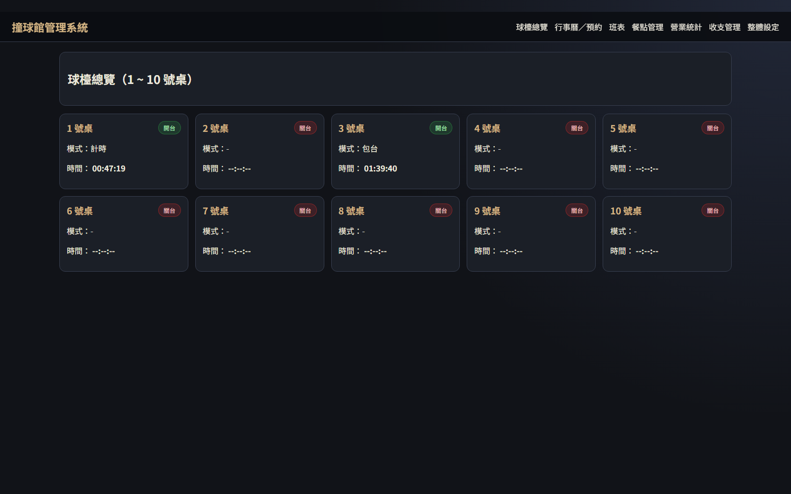
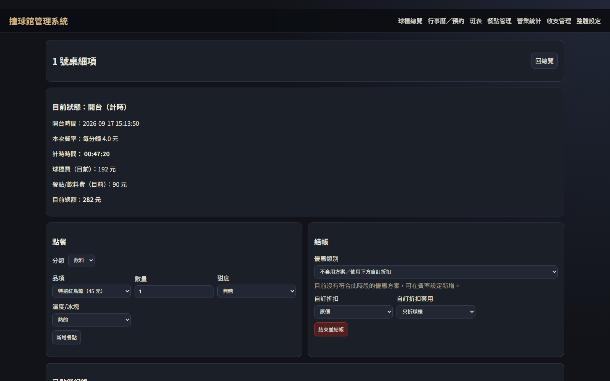
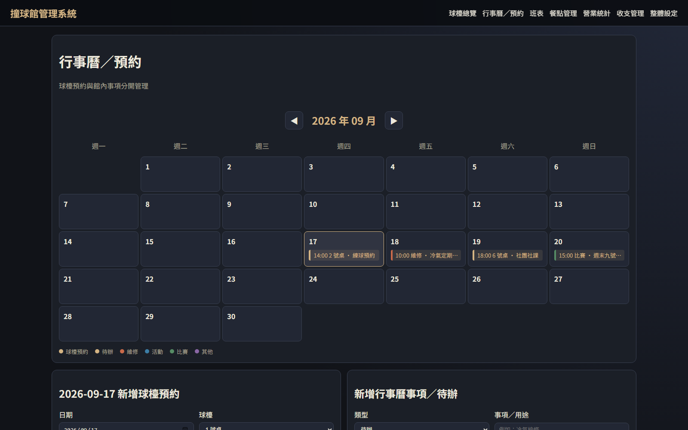
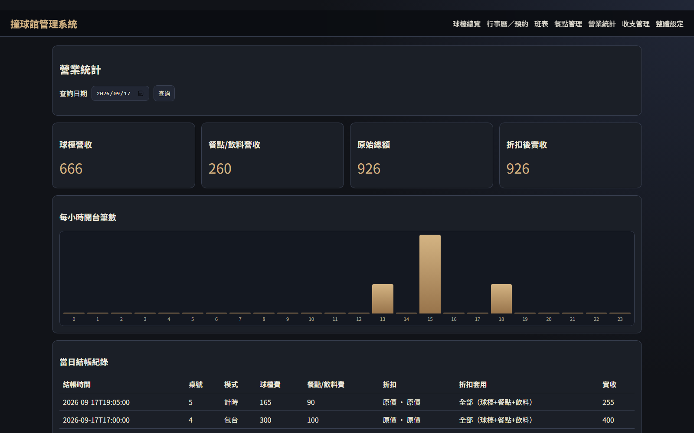

# 撞球館營運管理系統

[English](README.md) | [繁體中文](README.zh-TW.md)

[](https://github.com/cloud-sky-0128/billiard-management-system/actions/workflows/tests.yml)

## 專案簡介

這是一套為單一撞球館設計的本機優先營運管理系統，使用 Python、Flask、SQLite、Jinja2、HTML/CSS 與原生 JavaScript 開發。系統涵蓋計時與包台、換桌與加時、餐飲點單、分次收款、預約、員工排班、每日收支、營運統計及資料備份等流程。

專案起因是我對撞球有興趣，也與一位參與籌備撞球館的朋友討論過實際需求。現有系統常難以配合個別場館的流程，因此我想透過這個專案，嘗試把球檯管理、計費規則、排班、報表與未來的硬體燈控整合成一套可維護的應用程式。

相較於單純實作 CRUD 功能，我更著重於把實際營運規則轉化為可維護的資料模型、可測試的商業邏輯，以及能在本機部署的完整應用程式。

## 專案狀態

| 項目 | 狀態 |
| --- | --- |
| 核心營運流程 | 已完成主要功能，並使用測試／示範資料驗證 |
| Windows 瀏覽器版 | 已打包並發布 |
| 獨立視窗版 | 已提供預覽版本 |
| 實體球檯燈控 | 尚未整合；硬體控制整合列為未來擴充方向 |
| 撞球館正式營運 | 尚未實際部署 |

目前系統定位為單一場館、本機執行、低併發環境使用，尚未以球館正式資料或長期日常營運進行驗證。

## 主要功能

- 球檯計時與包台計費
- 加時與換桌
- 餐飲點單、候位帳與純餐飲結帳
- 分次與多筆收款紀錄
- 球檯預約與行事曆管理
- 員工與班表管理，以及個人班表匯出
- 每日實收、支出與營運統計
- 自動資料庫備份、驗證與復原支援

## 畫面預覽

以下畫面皆使用示範資料。

### 球檯總覽



### 球檯使用與結帳明細



### 預約行事曆



### 營運統計



## 工程設計重點

| 面向 | 實作方式 |
| --- | --- |
| 應用程式結構 | Flask Application Factory、依功能拆分的 Blueprints，以及計費、營業日與排班服務模組 |
| 資料完整性 | SQLite 外鍵、限制條件、交易、索引與部分唯一索引 |
| 金額計算 | 金額以整數分儲存；使用 `Decimal` 轉換與計算輸入，避免二進位浮點誤差 |
| 歷史一致性 | 球檯使用紀錄保存當時費率；訂單保存當時品項、分類、單價與小計；付款表保存實際收款事件 |
| 原子操作 | 透過資料庫交易保護開桌、預約建立與排班等可能發生衝突的寫入操作，適當情況使用 `BEGIN IMMEDIATE` |
| 防止重送 | 對指定的狀態異動請求使用操作識別碼與處理紀錄，避免重複執行 |
| 安全補強 | CSRF 驗證、輸入上限、密碼變更後撤銷既有登入，以及敏感操作稽核紀錄 |
| 穩定性 | SQLite 自動備份、備份驗證、還原檢查與打包版資料路徑處理 |
| 打包與發布 | PyInstaller Windows 打包，以及 GitHub Actions 語法檢查、測試、打包、校驗碼與標籤發布流程 |

歷史快照能確保之後即使修改菜單或費率，既有交易仍可還原當時使用的名稱、價格、折扣與付款內容。

Repository 目前包含超過 100 項自動化迴歸與補強測試，涵蓋計費邊界、跨日規則、重複提交、預約與班表衝突、併發操作、錯誤輸入、資料遷移、備份驗證及安全性邊界情況。

## 系統架構

```text
瀏覽器或桌面視窗
        |
        v
   Flask 應用程式
        |
        v
   功能 Blueprints
        |
        v
      服務層
        |
        v
      SQLite
```

一般請求會由 Flask 路由進入共用商業邏輯，再讀寫資料庫，最後回傳 Jinja 頁面或檔案。需要重複使用或獨立測試的規則會放在路由以外的服務模組。

詳細架構、資料流、資料表概要與設計決策請參考 [docs/ARCHITECTURE.md](docs/ARCHITECTURE.md)。

## 資料模型與設計決策

營運計費流程以四個互相關聯的概念為核心：

```text
customer_tabs
   |-- sessions
   |-- orders
   `-- payments
```

- `customer_tabs` 代表一次顧客消費與帳單的完整生命週期。
- `sessions` 代表實際球檯使用，以及當次採用的費率。
- `orders` 保存餐飲購買內容及交易當下的品項快照。
- `payments` 保存每一次實際收款，因此同一帳單可以分次付款。

其他資料表則處理預約、員工、班別、班表、每日實收、支出、系統設定、防重送操作紀錄與稽核事件。SQLite 是配合單機部署所做的刻意選擇：安裝與備份較單純，同時仍提供交易、限制條件、外鍵與索引。若未來改為多台電腦或多分店共用，則需要集中式資料庫，以及不同的登入與部署架構。

## 技術組成

### 後端

- Python 3
- Flask
- Waitress，供打包後的本機服務使用

### 資料庫

- SQLite
- SQL 遷移與資料完整性限制

### 前端

- Jinja2 模板
- HTML 與 CSS
- 原生 JavaScript

### 測試

- Python `unittest`
- Flask test client
- 暫存 SQLite 測試資料庫

### 打包與發布

- PyInstaller
- pywebview / WebView2，供獨立視窗預覽版使用
- GitHub Actions

## 技術選擇原因

### Flask 與 Jinja2

這是一套內部營運工具，不是公開內容平台，也不需要高度互動的 SPA。伺服器端渲染可以保持請求流程、驗證及部署方式單純，並避免額外加入前端建置系統。

### SQLite

SQLite 符合目前離線優先、單一場館、低併發的使用範圍。它降低安裝與維護成本，也保留這個領域需要的交易與完整性功能。這是依照目前範圍做出的工程選擇，不代表 SQLite 適合所有規模的部署。

### 服務層

共用的計費、營業日與排班規則會與 HTTP 路由分離，減少重複邏輯，也讓邊界情況能直接測試。

## 自動化測試

在 repository 根目錄執行完整測試：

```bash
python -m unittest discover -s tests -v
```

目前共有超過 100 項自動化測試，包含：

- 分鐘邊界計費與整數金額四捨五入
- 包台加時與換桌
- 跨日優惠、預約與班表
- 併發預約及開桌衝突
- 防止同桌重複開台與請求重送
- 分次付款與重複付款處理
- 備份損毀或逾時偵測
- 資料表遷移相容性與錯誤輸入處理

GitHub Actions 會在推送至 `main` 或建立 Pull Request 時執行 Python 語法檢查與自動化測試。

## 本機開發

```bash
git clone https://github.com/cloud-sky-0128/billiard-management-system.git
cd billiard-management-system
python -m venv .venv
```

啟用虛擬環境後執行：

```bash
python -m pip install -r requirements.txt
python app.py
```

接著在同一台電腦開啟 `http://127.0.0.1:5000`。安裝完相依套件後，本機開發不需要連線到網際網路。

## Windows 版本

已打包的 Windows 版本可從 [GitHub Releases](https://github.com/cloud-sky-0128/billiard-management-system/releases) 下載。目前建議使用瀏覽器版；獨立視窗版仍屬預覽版本，並使用 Microsoft Edge WebView2 Runtime。

安裝、資料位置、備份、校驗碼及疑難排解等詳細說明放在：

- [Windows 可攜式／瀏覽器版](docs/WINDOWS_PORTABLE.md)
- [獨立視窗預覽版](docs/WINDOWS_WINDOW_PREVIEW.md)

## 目前限制

- 系統目前僅使用測試／示範資料驗證，尚未實際部署於撞球館。
- 實體球檯燈控尚未整合，也尚未使用真實硬體進行驗證。
- 目前架構以單一場館、單一本機為目標，不是多分店或雲端系統。
- SQLite 適合目前低併發範圍；多台電腦同時共用不在現階段設計目標內。
- 共用管理員登入無法辨識每一項操作實際由哪位員工執行。
- 獨立桌面視窗仍是預覽版本，還需要更多乾淨電腦驗收。

## 文件

- [系統架構與設計決策](docs/ARCHITECTURE.md)
- [Windows 可攜式／瀏覽器版說明](docs/WINDOWS_PORTABLE.md)
- [獨立視窗預覽版說明](docs/WINDOWS_WINDOW_PREVIEW.md)
- [Windows 下載版驗收報告](docs/DOWNLOAD_ACCEPTANCE_2026-10-07.md)
- [Windows 發布檢查清單](docs/DOWNLOAD_RELEASE_CHECKLIST.md)
