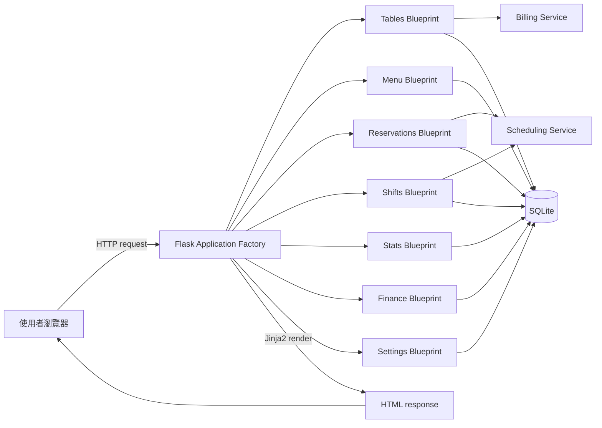
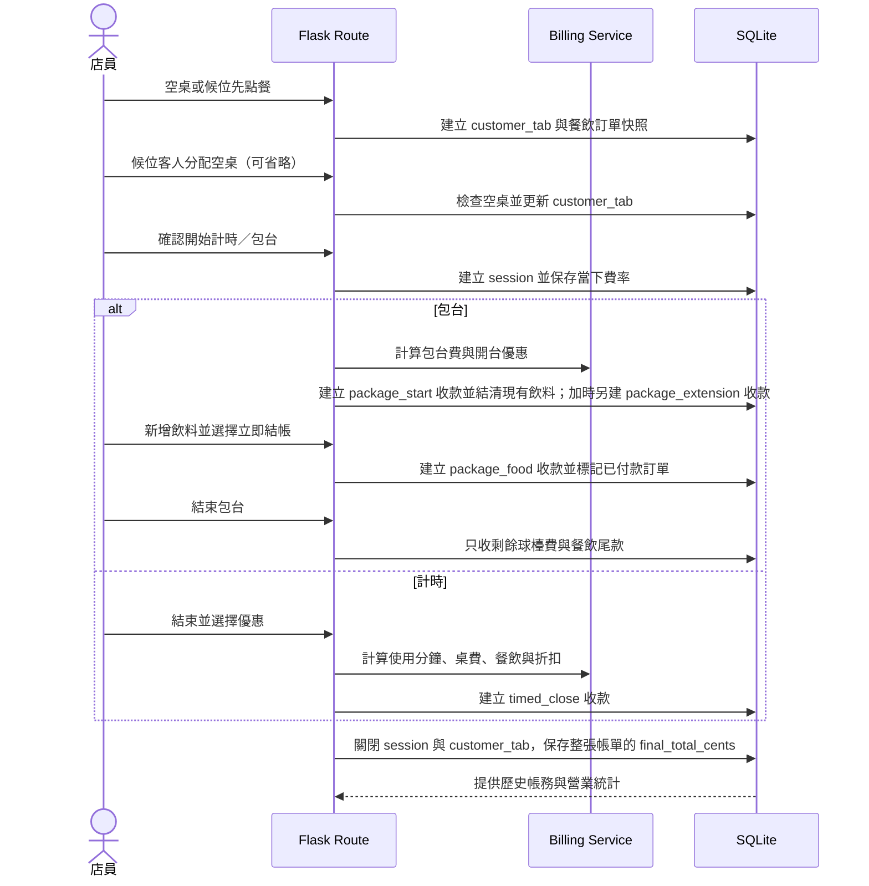

# 技術設計與資料模型

[回到使用者 README](../README.md)

本頁整理實作架構、核心資料表、資料流程與技術選擇；適合開發與維護時查閱。

## 技術棧

- **Backend:** Python、Flask、Blueprint、Application Factory
- **Frontend:** HTML、CSS、Jinja2、Vanilla JavaScript、Canvas
- **Database:** SQLite、SQL constraints、foreign keys、partial unique index
- **Testing:** Python `unittest`、Flask test client、temporary SQLite database
- **Desktop packaging:** Waitress、PyInstaller；獨立視窗預覽版另用 pywebview / WebView2
- **Architecture:** Server-side rendering、service layer、feature-based Blueprint modules

## 系統架構



### 專案結構

```text
app.py                         # 程式啟動入口
billiard_app/
├── __init__.py                # Application Factory 與 Blueprint 註冊
├── config.py                  # 常數、預設設定及初始菜單
├── db.py                      # SQLite 連線、初始化及 schema migration
├── audit.py                   # 高風險操作紀錄
├── maintenance.py             # 完整備份、快照輪替與健康檢查
├── security.py                # CSRF 與來源檢查
├── schema.sql                 # 資料表、constraint 與 index
├── blueprints/
│   ├── tables.py              # 開台、加時、點餐及結帳
│   ├── menu.py                # 菜單 CRUD
│   ├── reservations.py        # 預約、行事曆及待辦
│   ├── shifts.py              # 員工、班別及排班
│   ├── stats.py               # 營業統計
│   ├── finance.py             # 實收、支出及 CSV 月報
│   └── settings.py            # 費率、優惠與資料清除
└── services/
    ├── billing.py             # 計時、包台與折扣共用邏輯
    ├── business_day.py        # 跨午夜營業日邊界與日期歸屬
    └── scheduling.py          # 月曆與跨日時間處理
templates/                     # Jinja2 HTML templates
static/style.css               # 響應式介面樣式
scripts/seed_demo.py           # 建立不含個資的展示資料庫
tests/test_app.py              # 自動化 regression tests
tests/test_hardening.py        # 安全與邊界回歸測試
docs/screenshots/              # README 展示畫面
```

## 核心資料表簡圖

此圖只列出核心資料表，完整結構請以 [schema.sql](../billiard_app/schema.sql) 為準。

```mermaid
erDiagram
    categories ||--o{ menu_items : contains
    customer_tabs ||--o{ orders : contains
    customer_tabs ||--o| sessions : starts
    customer_tabs ||--o{ payments : pays
    sessions ||--o{ payments : records
    discount_types o|--o{ sessions : applied_to
    employees o|--o{ shifts : assigned_to
    shift_types o|--o{ shifts : classifies

    categories {
        INTEGER id PK
        TEXT name UK
        INTEGER is_active
    }
    menu_items {
        INTEGER id PK
        INTEGER category_id FK
        TEXT name
        INTEGER price_cents
        INTEGER is_active
    }
    table_rates {
        INTEGER table_no PK
        INTEGER timed_rate_per_min_cents
        INTEGER package_rate_per_hour_cents
        INTEGER package_enabled
    }
    discount_types {
        INTEGER id PK
        TEXT name UK
        TEXT pricing_method
        REAL discount_percent
        INTEGER package_rate_per_hour_cents
        TEXT applicable_mode
        TEXT discount_scope
    }
    sessions {
        INTEGER id PK
        INTEGER customer_tab_id FK
        INTEGER table_no
        TEXT mode
        TEXT start_time
        TEXT end_time
        TEXT status
        INTEGER rate_per_min_cents
        INTEGER rate_per_hour_cents
        INTEGER final_total_cents
        INTEGER discount_type_id FK
    }
    orders {
        INTEGER id PK
        INTEGER customer_tab_id FK
        INTEGER session_id FK
        INTEGER item_id
        TEXT item_name
        TEXT item_category_name
        INTEGER unit_price_cents
        INTEGER quantity
        INTEGER subtotal_cents
        INTEGER payment_id FK
    }
    customer_tabs {
        INTEGER id PK
        TEXT display_name
        INTEGER guest_count
        INTEGER table_no
        TEXT status
        TEXT opened_at
        TEXT closed_at
        INTEGER final_total_cents
    }
    payments {
        INTEGER id PK
        INTEGER customer_tab_id FK
        INTEGER session_id FK
        TEXT payment_type
        INTEGER table_fee_cents
        INTEGER food_fee_cents
        INTEGER discount_amount_cents
        INTEGER amount_cents
        TEXT paid_at
    }
    reservations {
        INTEGER id PK
        INTEGER table_no
        TEXT guest_name
        TEXT start_time
        TEXT end_time
        TEXT status
    }
    calendar_items {
        INTEGER id PK
        TEXT title
        TEXT item_type
        TEXT scheduled_date
        TEXT status
    }
    employees {
        INTEGER id PK
        TEXT name UK
        TEXT color
        INTEGER is_active
    }
    shift_types {
        INTEGER id PK
        TEXT name UK
        TEXT start_time
        TEXT end_time
        INTEGER ends_next_day
    }
    shifts {
        INTEGER id PK
        INTEGER employee_id FK
        INTEGER shift_type_id FK
        TEXT staff_name
        TEXT shift_type_name
        TEXT start_time
        TEXT end_time
    }
    daily_cash_records {
        TEXT record_date PK
        INTEGER actual_revenue_cents
        TEXT note
    }
    expenses {
        INTEGER id PK
        TEXT expense_date
        TEXT category
        TEXT description
        INTEGER amount_cents
    }
    settings {
        TEXT key PK
        TEXT value
    }
```



## 主要資料流程

### 點餐、分桌到結帳



若客人沒有打球，候位或待開台消費單可以直接只結餐飲費，不產生 `sessions`。
球檯總覽的時段圖仍統計實際開台筆數，不把候位或待開台算入。

### 歷史快照設計

- `customer_tabs` 保存客人的帳單生命週期，`sessions` 只保存真正開始打球的球檯時間。
- 開台時將當下的每分鐘或每小時費率寫入 `sessions`。
- 點餐時將品名、分類、單價與小計寫入 `orders`。
- 結帳時保存折扣名稱、折扣方式、折扣金額與 `final_total_cents`。
- `payments` 保存每一次實際收款；包台開台與加時先收球檯費，計時則在結束時收款。
- `orders.payment_id` 將餐飲連到實際收款，避免分次結帳後在關台時重複收費。
- 即使之後修改菜單、費率或優惠，歷史營收仍能按照當時資料還原。
- 所有金額皆以整數分（`*_cents`）保存，輸入時使用 `Decimal` 四捨五入，避免浮點數累積誤差。
- 實際收款在入帳前四捨五入為整元；報表以實收紀錄計算，不另設整元調整欄位。

## 資料完整性設計

- `CHECK` constraints 限制費率、價格、狀態與時間格式。
- SQLite foreign keys 維護菜單、訂單、員工與班別關係。
- Partial unique index 保證同一桌最多只有一筆進行中消費單與一筆 `active` session。
- 候位分桌與開台使用 `BEGIN IMMEDIATE`，避免兩位員工同時占用同一桌。
- 預約與排班以 `BEGIN IMMEDIATE` 將時段重疊檢查與寫入包在同一筆 transaction，避免並行請求重複建立。
- 測試資料清除使用 transaction，並在刪除前以 SQLite backup API 建立完整備份。

## 技術選擇

| 選擇 | 原因 |
| --- | --- |
| Flask + Jinja2 SSR | 系統以館內管理操作為主，不需要 SPA 的額外複雜度 |
| Application Factory | 測試可替換暫存資料庫，啟動設定也不綁定全域 app |
| Blueprint | 依球檯、菜單、預約、班表、財務等功能拆分 routes |
| SQLite | 單一場館、低併發情境部署簡單，且支援 transaction 與 constraint |
| Service layer | 將計費與排程邏輯從 HTTP route 抽離，方便重用及邊界測試 |
| Server-side snapshots | 保存交易當下資料，避免設定變更破壞歷史帳務 |
| Integer cents + Decimal | 金額以整數分保存，避免 SQLite `REAL` 與 Python `float` 的精度誤差 |

## 面試可說明的技術亮點

1. **資料一致性：** 重複開台使用 partial unique index；預約與排班用 immediate transaction 將查核及寫入原子化，阻止競態條件。
2. **歷史資料設計：** 訂單保存 `item_name`、`item_category_name`、`unit_price_cents`，session 保存費率與折扣快照。
3. **複雜時間規則：** 支援包台倒數、分鐘進位、跨午夜優惠及隔日凌晨班別衝突判斷。
4. **安全資料清除：** 使用 transaction、多重確認、開台檢查與刪除前備份降低誤刪風險。
5. **可測試架構：** Application Factory 可注入暫存 database，回歸測試不會污染正式資料。
6. **金額精度：** schema 使用整數分，表單金額由 `Decimal` 轉換，並提供自動備份的舊資料遷移。
